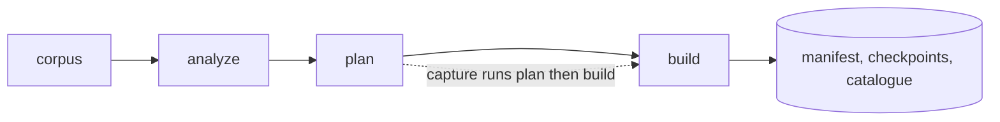

The pipeline is the offline component that produces checkpoints. It decides which Python packages to keep loaded in memory, starts a sandbox that imports them, and saves the sandbox to disk. Each saved copy is a checkpoint, and a worker restores one at request time instead of importing the packages from scratch.

This page explains what the pipeline does. To run it, see [Build checkpoints](/docs/contributing/build-checkpoints). For the definition of a checkpoint, see [Checkpoints](/docs/concepts/checkpoints).

## Stages

The pipeline is a command-line tool, `readie-pipeline`, in the `pipeline/` directory. It has five commands.



| Stage | What it does | Reads | Writes |
| --- | --- | --- | --- |
| `corpus` | Asks a hosted language model for realistic code snippets and records which packages each one imports. | Azure OpenAI credentials | `data/datasets/<flavor>.json` |
| `analyze` | Imports every package in the base image in a separate process and measures it. | The corpus, the packages installed in the image | `data/metadata/<flavor>.json` |
| `plan` | Chooses what each checkpoint pre-imports and writes the sandbox specification. | Corpus and metadata | `checkpoints.json` (the plan), a spec fingerprint |
| `build` | Captures one checkpoint per planned set, times a restore of each, writes the outputs. | The plan | Checkpoints, manifest, catalogue |
| `capture` | Runs `plan` and then `build` in one process. | Same | Same |

The `corpus` stage is an authoring step that requires a model account. The repository already contains a corpus, so the stage is normally skipped. The `plan` and `build` stages are joined into `capture` because `plan` writes the sandbox spec inside the container, and a second container would not see it.

## Analyzer measurements

For each package, in a fresh process, `analyze` records four values:

- **Import time:** seconds to import the package when its dependencies are already loaded.
- **Memory:** the extra anonymous (heap) memory that the package adds, read from `RssAnon` in `/proc/self/status`.
- **Disk size:** recorded, but not used by the planner.
- **Loaded modules:** every module that appears after the import, which gives the dependencies of the package.

The planner charges for memory and not for disk. gVisor must save the memory of the process when it freezes the process. File-backed pages are re-mapped from the shared filesystem on restore, so they cost nothing to store.

## Plans

A plan is a list of checkpoints, written as JSON. Each entry states which imports to pre-load, how many corpus requests the checkpoint serves, the estimated seconds saved, and the memory size in MB.

The default `greedy` planner works on the corpus as follows. Every distinct set of packages that some request needs, plus dependencies, is a *candidate checkpoint*. The planner scores a candidate by a cost for every request:

> cost of serving a request from a checkpoint = `alpha` x checkpoint size (MB) + import time of everything the request needs that the checkpoint does not hold

Here `alpha` is seconds per MB, the price of a large checkpoint. In each round, the planner adds the candidate that lowers the total cost over all requests the most. It stops when no candidate improves the cost, when the size budget is used up, or when the maximum count is reached. Ties break on package name, so the same inputs always produce the same plan. The planner ignores packages in the Python standard library and packages used by fewer than 0.2% of requests.

The `build` stage always adds an empty checkpoint, `checkpoint_0`, in front of the plan, so that a cold start is an option with a measured cost. The planner can also be switched to a `fixed` planner, which returns a configured package set (by default `pandas` and `numpy`).

### Worked example

The following example is illustrative. It uses ten requests: five need `pandas`, three need `torch`, and two need only `numpy`. Both `pandas` and `torch` also load `numpy`. The measurements are made up for the example:

| Package | Extra memory | Import time |
| --- | --- | --- |
| `numpy` | 60 MB | 0.15 s |
| `pandas` | 80 MB | 0.90 s |
| `torch` | 400 MB | 4.0 s |

The example has three candidates: `{numpy}` at 60 MB, `{pandas, numpy}` at 140 MB, and `{torch, numpy}` at 460 MB. With an illustrative `alpha` of 0.005 (not the real value, which is measured and changes), their size costs are 0.3 s, 0.7 s, and 2.3 s. The cost for each request type (numpy-only, pandas, torch) is:

| Candidate | numpy-only | pandas | torch |
| --- | --- | --- | --- |
| `{numpy}` | 0.3 | 0.3 + 0.9 = 1.2 | 0.3 + 4.0 = 4.3 |
| `{pandas, numpy}` | 0.7 | 0.7 | 0.7 + 4.0 = 4.7 |
| `{torch, numpy}` | 2.3 | 2.3 + 0.9 = 3.2 | 2.3 |

The planner weights these costs by the request counts (2, 5, 3) and proceeds in rounds:

1. First round totals: `{numpy}` 19.5, `{pandas, numpy}` 19.0, and `{torch, numpy}` 27.5. The planner picks `{pandas, numpy}`.
2. Second round, taking the cheapest pick per request type: adding `{torch, numpy}` gives 11.8, and adding `{numpy}` gives 17.0. The planner picks `{torch, numpy}`.
3. Third round: adding `{numpy}` gives 11.0, which is lower than 11.8. The planner picks it.
4. Nothing is left to add.

Running the real planner on this input gives the same three checkpoints, serving 5, 3, and 2 requests. With no checkpoints, the total import cost over the ten requests is 18 s. With these three checkpoints, the total is 11 s, all of it size cost.

If `torch` imported in only 0.5 s, it would not be worth its 2.3 s of size cost. Running the planner on that variant picks only the other two checkpoints. This trade-off is what `alpha` controls.

## Capturing a checkpoint

The `build` stage repeats these steps for each plan entry:

1. Write a sandbox spec with `EXECUTOR_MODE=capture` and `READIE_PREIMPORT` set to the comma-separated package list. The spec comes from the spec builder of the worker (a small program called `ocispec`), so the capture sandbox has the same shape as the sandbox that the worker restores into.
2. Run `runsc run` on that spec, with two gVisor annotations that turn on checkpointing and name the output directory.
3. Inside the sandbox, the [executor](/docs/architecture/executor-protocol) imports the packages and then writes to `/proc/gvisor/checkpoint`. That call blocks while gVisor saves the memory and state of the process into the checkpoint directory.
4. Delete the sandbox, always, even on failure.
5. Write `meta.json` next to the image files.
6. Restore the checkpoint once in `measure` mode and time it. The executor exits immediately after the restore, so the timing covers only the restore.

Capture requires a privileged container and an amd64 gVisor host. It does not run on Apple Silicon or in ordinary CI.

After all checkpoints are captured, the pipeline fits a straight line through the (size, restore time) pairs and takes its slope as the measured `alpha`. A line fit keeps the fixed cost of starting any sandbox from distorting small checkpoints, which an average of ratios would not. The pipeline prints the planned and measured values side by side.

## Outputs

The pipeline writes everything into one directory per flavor (`pipeline/out/<flavor>` through the Makefile):

```text
manifest.json
catalogue.json
checkpoints/
  checkpoint_0/        empty checkpoint
    meta.json
    ...runsc image files
  checkpoint_1/
  ...
```

- **`manifest.json`** records the gVisor version, a fingerprint of the sandbox spec, the executor command, the executor protocol version, the Python path, and the overlay and network modes. The worker refuses checkpoints whose protocol version it does not implement.
- **`meta.json`** repeats the version and fingerprint for one checkpoint and lists its imports.
- **`catalogue.json`** is for the router. It lists every measured package with its memory size, import time, and dependencies, plus the contents and size of each checkpoint. It also stores the measured `alpha`.

The worker checks the fingerprint and the gVisor version at startup. If either differs from its own, the worker drops all checkpoints and serves cold starts only. This is the default, and `CHECKPOINT_STRICT_COMPAT` turns the check into a warning. For this reason, the checkpoints, the filesystem, and the gVisor binary are baked into one image.

## What's next

- [Flavors and catalogues](/docs/concepts/flavors-and-catalogues): how the catalogue is organized per flavor.
- [Cost model](/docs/concepts/cost-model): how the router uses the catalogue and `alpha`.
- [Design decisions](/docs/architecture/design-decisions): the reasons behind choices such as the single image.
