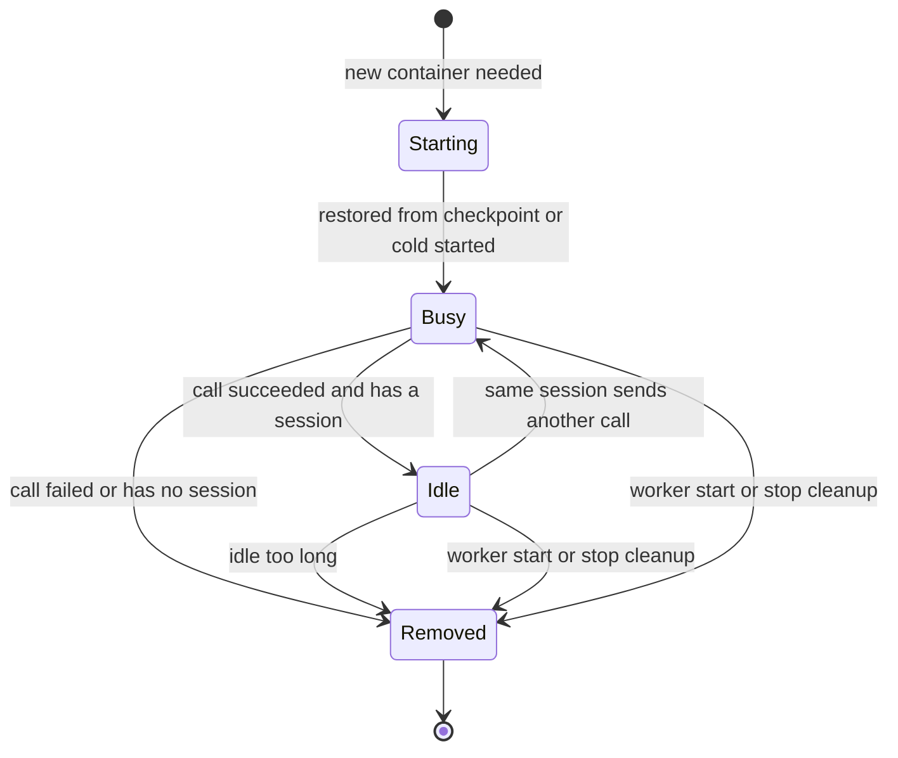

A container is the sandbox that a worker creates to run a function call. The worker keeps one container per running call. When a call succeeds and belongs to a session, the worker leaves the container running and idle so that the next call in the session can reuse it. If no call returns within five minutes, the worker removes the container.

This page follows one container through the Go worker. It assumes familiarity with [sandboxes](/docs/concepts/sandboxes) and [checkpoints](/docs/concepts/checkpoints). For definitions of terms such as session, see the [glossary](/docs/concepts/glossary).

## States

The worker reports each change to the router. It reports `BUSY` when a container is acquired, `READY` when the container goes idle, `REMOVED` when the container is destroyed, and `ERROR` when a failure occurs. Reporting is best effort. If the router is unreachable, the call still runs.

## Starting a container

When a request arrives without a container ID, the worker creates a new container in this order:

1. **Look up the root filesystem and, if the router named one, the checkpoint.** If no root filesystem exists, the request fails, because there is nothing to start. If the named checkpoint is missing, the worker logs a warning and starts cold instead.
2. **Prepare a private host directory.** The executor in the sandbox creates its socket there, and the worker connects to it.
3. **Provision a network namespace.** This step happens only when `SANDBOX_NETWORK` is `sandbox` (the default). See the [security model](/docs/architecture/security-model).
4. **Create the container** with `runsc`, the gVisor runtime. The memory limit is the memory budget of the request, or `DEFAULT_CONTAINER_MEM` (1 GiB) if the request has none. CPU is capped at half a core (quota 50000 per 100000 microseconds) and processes at 100. These two values are fixed in the worker.
5. **Start the container.** With a checkpoint, the worker *restores* it. Without a checkpoint, or if the restore fails, the worker performs a *cold start*: it boots the executor from scratch, and the executor imports packages as the function needs them.

A failed restore is not an error. The worker logs the failure, starts cold on the same filesystem, and reports to the router which checkpoint it actually used. See [Cold starts and restore](/docs/concepts/cold-starts-and-restore) for the reason that restore is faster.

## Busy

While a call runs, the container counts as "acquired". The load report of the worker to the router counts only acquired containers and reserves the memory limit of each one. Idle containers are not counted, even though they still hold memory on the machine.

Each call has an overall deadline, `EXECUTION_TIMEOUT` (default one hour).

## Idle

When a call succeeds and the request belongs to a session, the container becomes idle. Two details of this state affect behavior:

- **Idle containers keep running.** The worker does not pause or freeze them. It records the time that each container went idle and reports `READY` to the router. The runtime wrapper has pause and unpause operations, but the container manager never calls them.
- **Calls without a session never go idle.** With no session, nothing can request that container again, so keeping it would waste memory. The worker destroys the container right after the call.

A call that returns an error from the function still counts as a success for the worker, because the sandbox ran correctly. See [Executor protocol](/docs/architecture/executor-protocol). A failure of the sandbox itself, a timeout, or a client that disconnected destroys the container instead.

Cleanup runs in the background after the response is sent, with its own 30-second limit (`ReleaseTimeout`), so the caller does not wait for teardown.

## Resuming an idle container

If the next call in the session names the container, the worker creates nothing. It clears the idle timer and re-applies the memory limit for the new call. If the container is already gone, for example because it was reaped, the update fails, the worker reports `ERROR`, and the call fails. The worker never retries a resumed call automatically.

## Idle timeout and reaping

Every 30 seconds, the worker scans idle containers and destroys any that have been idle for at least `SANDBOX_IDLE_TTL`. The default is five minutes. The timer restarts each time the container goes idle again. Setting `SANDBOX_IDLE_TTL` to `0` turns reaping off entirely, and idle containers then live until the worker stops.

## Memory growth and out-of-memory retry

Memory is the one limit that can grow while a function runs.

**Proactive growth.** The worker samples each running container about once a second. If memory use reaches 90% of the limit (`MEM_GROWTH_THRESHOLD`), the worker multiplies the limit by 2 (`MEM_GROWTH_FACTOR`). The limit never exceeds a ceiling: the maximum memory budget of the request or, if none was set, 90% of `WORKER_MEM_TOTAL` (default 4 GiB). Changing the limit does not invalidate checkpoints. The live change is best effort and might not take effect in every environment.

**Reactive retry.** If a sandbox is killed before growth can help, the executor produces no complete response. The worker treats that as "looks like out of memory", because it cannot see the real cause, and retries once with a new container and a larger limit, up to the same ceiling. The worker buffers the request body so that it can replay it. Because the function runs twice, retries have limits:

- A retry happens only for a new container. A session resume is never retried.
- A retry happens only when there is room to grow.
- A retry never happens after the caller cancelled.

If the function has side effects, such as writing to an external service, a retry might repeat them.

## Reclaiming orphans

If a worker crashes, its containers and host directories remain. On startup, before it accepts requests, the worker lists every container whose name carries its prefix and destroys them. It does the same during shutdown, after waiting up to `ReleaseTimeout` for in-flight cleanups. A failure in this step is logged and does not stop the worker from starting.

## Starting without checkpoints

A worker can start with no root filesystem. It then registers with the router as `ERROR` instead of `READY`, so the router does not place work on it, and every request fails with a message that names the missing artifact. See [Build checkpoints](/docs/contributing/build-checkpoints).

## What's next

- [Request lifecycle](/docs/architecture/request-lifecycle): where container acquisition fits in a call.
- [Placement](/docs/architecture/placement): how the router chooses the container.
- [Executor protocol](/docs/architecture/executor-protocol): how the worker talks to the sandbox.
