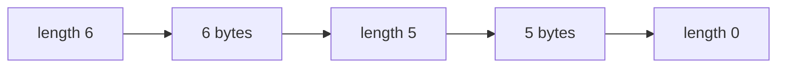

The executor is a Python program that runs inside every sandbox. It listens on a local Unix socket, receives a pickled function from the [worker](/docs/concepts/components), runs it, and returns a pickled result. Each message is split into length-prefixed chunks and ends with a zero-length chunk, so a truncated message is never mistaken for a complete one.

This page specifies the executor startup sequence, the framing, and the message contents. To change the format, see [Changing the executor protocol](/docs/contributing/changing-executor-protocol).

## Startup sequence

The executor starts with `python -u -m readie_executor`. The order of the steps matters, because a [checkpoint](/docs/concepts/checkpoints) freezes the process part-way through startup.

1. Read settings from environment variables. `EXECUTOR_DIR` is required and names the directory that holds the socket. If it is missing, the executor exits with code 2.
2. In capture mode, import the packages named in `READIE_PREIMPORT`, then write to `/proc/gvisor/checkpoint`. gVisor freezes the process at this point, and the write blocks until the checkpoint is complete.
3. After a restore, the same process resumes at that line. The executor re-reads the environment that the new sandbox was given, because the frozen copy still holds the old environment.
4. In measure mode, exit immediately. The pipeline uses this to time a restore.
5. Bind the socket at `$EXECUTOR_DIR/executor.sock`, then serve calls indefinitely.

The executor binds the socket after the checkpoint. If it bound the socket earlier, the frozen process would retain a socket connected to a worker that no longer exists.

A cold start, with no checkpoint, skips steps 2 to 4 and binds the socket directly.

### Modes

`EXECUTOR_MODE` selects the path above. Any unknown value falls back to `sandbox`.

| Mode | Used by | Behavior |
| --- | --- | --- |
| `capture` | The [pipeline](/docs/architecture/building-checkpoints) | Pre-imports packages, then triggers the checkpoint. |
| `measure` | The pipeline | Restores, then exits immediately. |
| `sandbox` | The worker | Binds the socket and serves calls. This is the default. |

## Connection model

The executor is the server and the worker is the client. The worker dials `<workerDir>/<containerID>/executor.sock` through a bind mount and retries until the socket appears (up to 60 seconds by default). The executor accepts one connection at a time (listen backlog of 1), because a sandbox contains one interpreter and runs one call at a time.

## Framing

A message is a series of chunks followed by a zero-length chunk:

```text
message  = ( length  chunk )*  terminator
length   = 8 bytes, big-endian unsigned integer
terminator = 8 zero bytes   (a length of 0, with no chunk after it)
```



Chunking lets the worker forward a request while it is still arriving from the network, without knowing the total size. Implementations check the following limits before allocating memory:

- A chunk is at most 64 MiB.
- A message is at most 4 GiB.
- The default chunk size when sending is 1 MiB (`EXECUTOR_CHUNK_SIZE` on the executor).

A stream that ends before the terminator is an error on both sides. The Go worker reports it as a truncated response. A sender must not write an empty chunk in the middle of a message, because the receiver treats it as the end of the message.

### Byte-level example

The following is the output of the Python writer for the payload `hello world` with a chunk size of 6 bytes. It is also a case in the shared test fixture.

```text
00 00 00 00 00 00 00 06   length = 6
68 65 6c 6c 6f 20         "hello "
00 00 00 00 00 00 00 05   length = 5
77 6f 72 6c 64            "world"
00 00 00 00 00 00 00 00   length = 0, the end
```

An empty payload is encoded as the last line only: eight zero bytes.

## Message contents

### Request

A request is one message that contains a [cloudpickle](/docs/concepts/glossary) of a dictionary:

```python
{"func": <callable>, "args": (...), "kwargs": {...}, "packages": ["..."]}
```

The `packages` key is optional. If it is present, the executor runs `uv pip install` for those requirements before it calls the function. This happens on every call, including for packages that the filesystem already contains. If the sandbox has no resolver configured, the executor sets up DNS first.

### Response

A response is one message that contains a cloudpickle of an envelope:

```python
{"ok": True,  "value": <return value>, "output": ["..."]}
{"ok": False, "exc_type": "ValueError", "message": "...", "traceback": "...", "output": ["..."]}
```

`output` is a list of text captured from the function's stdout and stderr, plus the package install log. If the envelope itself cannot be pickled, for example because the return value is not picklable, the executor sends an `ok: False` envelope that describes the problem instead of closing the connection silently.

An `ok: False` envelope is not a worker failure. The sandbox worked and remains reusable, the worker reports success, and the client library turns the envelope into an exception. The worker never decodes the envelope. It passes the bytes to the router, and the [client](/docs/guides/sdk) unpickles them.

## Version checking

The framing has a version, currently 2. The pipeline writes it into `manifest.json` as `executor_protocol`. When the worker loads its checkpoints, it compares that number with the version it implements. A manifest with no number counts as version 1.

On a mismatch, the worker refuses to load the artifacts. The error names both versions and instructs you to rebuild the worker image with the current pipeline. This check replaces the alternative failure mode, a call that connects and then hangs.

Version 1 used a literal `EOF` and connection close. It could not distinguish a short message from a truncated one, and a function that raised sent nothing back. Version 2 fixes both.

## Implementations and golden fixture

The format is implemented twice: in Python (`executor/src/readie_executor/protocol.py`) and in Go (`worker/internal/executor/`). The Python side is the server and the Go side is the client, so an ordinary unit test cannot exercise them against each other.

Both implementations share the fixture `executor/tests/data/frames.golden.json`. It holds payloads and their encoded bytes for cases such as empty, one chunk, many chunks, and payloads that contain the old `EOF` bytes or every byte value.

- The Python tests encode and decode against the fixture.
- The Go tests decode the Python bytes and check that Go-written bytes decode back to the same payload.
- A Go test asserts that the fixture version equals the Go constant.
- CI regenerates the fixture and fails on any drift.

To regenerate the fixture, run the following command:

```bash
cd executor && uv run python tests/generate_golden.py
```

## Trust

The executor unpickles whatever the worker sends, which runs arbitrary code. This is intended: the sandbox is the boundary. See [Security model](/docs/architecture/security-model).

## See also

- [Changing the executor protocol](/docs/contributing/changing-executor-protocol)
- [Security model](/docs/architecture/security-model)
- [Design decisions](/docs/architecture/design-decisions)
