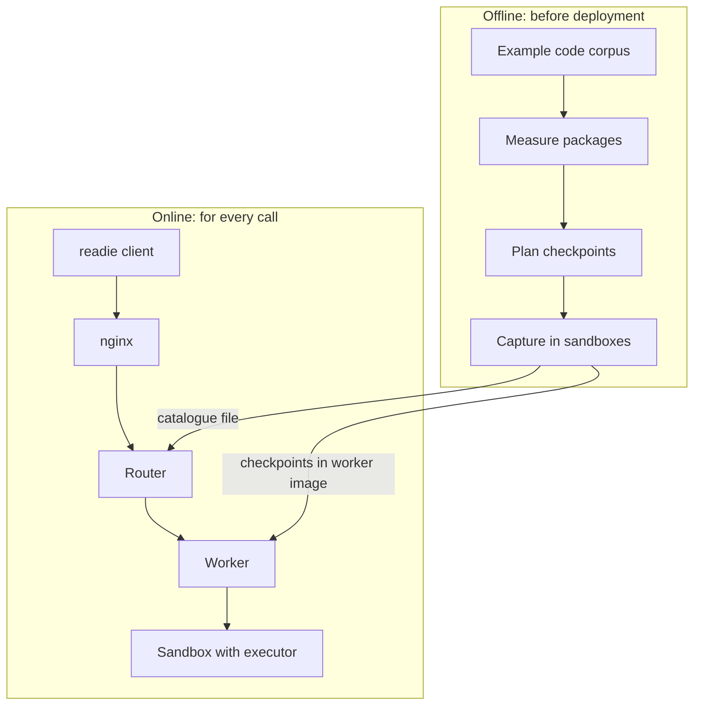

Readie is a system for running Python functions in gVisor sandboxes that start from checkpoints. It operates in two phases. Offline, a pipeline prepares checkpoints: saved Python processes with popular packages already imported. Online, a router sends each call to a worker, and the worker restores the best checkpoint into a sandbox and runs the function there. The offline phase reduces the start-up time of the online phase.

## System diagram

## Offline: preparing checkpoints

The pipeline (`pipeline/`) analyzes a large collection of example Python code. It determines which packages are imported most often and how long each takes to import. It groups packages into a small number of checkpoints. For each checkpoint, it starts a sandbox, imports the packages, and saves the process. It also writes a catalogue, a summary of the contents of each checkpoint, for the router.

The pipeline produces two artifacts:

- The checkpoints, which are baked into the worker's container image together with the root filesystem they were captured from.
- The catalogue, which is mounted into the router.

One set is built for each [flavor](/docs/concepts/flavors-and-catalogues) (`cpu` or `gpu`). Capturing requires an amd64 host running gVisor. See [Building checkpoints](/docs/architecture/building-checkpoints).

## Online: running a call

A call passes through five components:

1. **Client.** The `readie` package pickles the function and sends it over a gRPC stream. See [Request lifecycle](/docs/architecture/request-lifecycle).
2. **nginx.** In production, nginx terminates TLS and forwards the stream to the router.
3. **Router.** The router checks the session, filters and ranks workers, and picks a checkpoint using the [cost model](/docs/concepts/cost-model). See [Placement](/docs/architecture/placement).
4. **Worker.** The worker creates a [sandbox](/docs/concepts/sandboxes) from the chosen checkpoint, or resumes the existing sandbox of a session. See [Container lifecycle](/docs/architecture/container-lifecycle).
5. **Executor.** The executor is a small Python program inside the sandbox. It receives the call over a unix socket, installs any extra packages, runs the function, and returns the result. See [Executor protocol](/docs/architecture/executor-protocol).

The result travels back along the same path.

## State synchronization

The workers and the router do not share a database. Each worker pushes its state to the router. It registers once at start-up, reports its memory and container count every 10 seconds by default, and announces the state of each container. The router keeps this information in memory and checks the health of the workers on a timer. Because the state is not persisted, a router restart begins with an empty view of the cluster.

Some settings must agree between components, or the system degrades without an error:

- The sandbox settings of the worker (network mode, overlay, GPU) must match the settings used at capture time. The worker checks this at start-up and, by default, drops its checkpoints if they differ.
- The executor wire protocol version is recorded in the checkpoint manifest. The worker refuses a generation that it does not implement.
- The Python version of the client must match the Python version of the sandbox (3.12), because functions are pickled on one side and unpickled on the other. The client checks this when it is created.

## What's next

- [Components](/docs/concepts/components): the role of each part and the connections between them.
- [Security model](/docs/architecture/security-model): the trust boundaries and what protects what.
- [Design decisions](/docs/architecture/design-decisions): the reasons behind the design.
- [Quickstart](/docs/getting-started/quickstart): run a first remote function.
