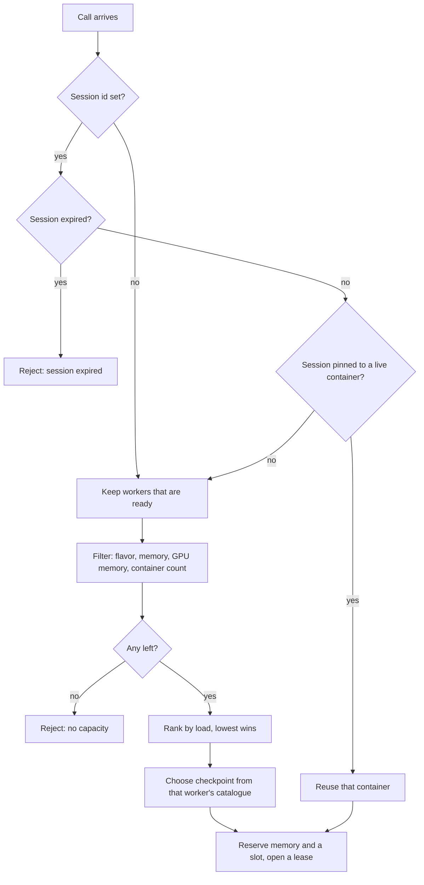

Placement is the router logic that selects a worker, a container, and a checkpoint for each call. If the call belongs to a session with a live container, the router always selects that container. Otherwise, the router drops the workers that cannot take the job, ranks the remaining workers by load, selects the least loaded one, and then selects a checkpoint for that worker.

Placement runs in the router, in `router/src/readie_router/scheduling/`. The same inputs always produce the same result, because the logic uses no randomness.

## Decision flow

### 1. Session affinity

If the call carries a [session](/docs/concepts/sessions) ID and the router knows a container for it, the router sends the call to that container. It does not filter or score workers. The container holds the live Python state of the session, and moving the session would lose that state. The router tolerates an imbalanced cluster to avoid losing state.

The router uses the pinned container only if its worker is still ready and the container is in the ready or busy state. If either condition fails, the router drops the pin and places the call like a new one.

Two special cases apply:

- If the session was marked expired because its container was destroyed, the router rejects the call with a "session expired" error. An ID that the router has never seen is not an error, and the call starts cold.
- If the call sets `disable_optimized_execution=True` and the container of the session was restored from a checkpoint, the router rejects the call. It does not silently ignore the flag, and it does not destroy the session state.

Calls with no session ID skip this step.

### 2. Candidates

Only workers that have reported a ready status and have an address are candidates. If there are none, the router rejects the call as "no workers available" (gRPC `UNAVAILABLE`, which the client raises as `ClusterUnavailableError`).

### 3. Filters

A worker must pass all four filters:

| Filter | A worker is dropped when |
| --- | --- |
| Flavor | The call needs a GPU and the worker is not a gpu worker. CPU calls pass every worker. |
| Memory headroom | Memory in use, plus memory already promised to calls in flight, plus this call's memory budget, would exceed 90 percent of the worker's total (`MEMORY_HEADROOM`, default `0.9`). Skipped if the worker has not reported a total. |
| GPU memory headroom | GPU memory in use plus this call's GPU budget would exceed 90 percent of the worker's GPU memory. Skipped when the call has no GPU budget or the worker offers no GPU memory. |
| Container count | The worker already holds its maximum number of containers (`WORKER_MAX_EXECUTORS`, counting calls still in flight). Skipped when the worker reports no limit. |

If candidates exist but none pass, the router rejects the call with "no worker can accept this request" (`RESOURCE_EXHAUSTED`).

Before filtering, a call with no memory budget receives the router default of 1 GiB (`DEFAULT_MEMORY`).

### 4. Ranking

Each remaining worker receives a sort key made of four numbers followed by the worker ID. The router compares the keys from left to right, and the lowest key wins:

1. **Flavor penalty.** The value is 1 for a CPU call on a gpu worker and 0 otherwise. This keeps CPU calls off GPU machines unless no other worker has room.
2. **Memory pressure.** The value is (memory in use plus reserved) divided by total memory.
3. **CPU pressure.** The value is CPU use divided by CPU total. The worker currently reports worker-level memory and container count but not CPU, so this term is normally 0.
4. **In-flight calls.** The value is the number of calls placed on that worker that have not finished.
5. **Worker ID.** The router compares the IDs as text, as the last tie-break.

Memory comes first because it is the tightest resource. In a fresh cluster, where every number is zero, the router picks the worker whose ID sorts first.

### 5. Checkpoint

For a new container (not a reused one), the router looks up the catalogue for the flavor of the chosen worker. It then picks the cheapest checkpoint for the modules that the client sent. See [Cost model](/docs/concepts/cost-model). With `disable_optimized_execution=True`, the router picks no checkpoint. With no catalogue loaded, it also picks none.

### 6. Reservation

The router decides and reserves in one step, with no pause in between. It adds one to the in-flight count of the worker and adds the memory budget of the call to a "reserved" total. A second call that arrives a moment later therefore already sees the load of the first call. If the call has a session and reuses a container, the router also records the session-to-container pin immediately.

When the call finishes, the router releases the reservation. If the call failed and that call created the session pin, the router clears the pin, so later calls do not queue behind a container that might never have existed.

## One call at a time per session

A session container is a single Python interpreter behind a single socket. The router therefore allows only one call per session to run at once. Other calls wait for their turn, for up to 60 seconds by default (`SESSION_WAIT_TIMEOUT`). After that, they fail with "session is busy" (`RESOURCE_EXHAUSTED`).

## Worker liveness

Workers report their state to the router through `RegistryService`. The following mechanisms keep the router view current:

- **Registering.** When a worker starts, it sends a ready status, retrying up to three more times if the router is not reachable. That message is its registration. It carries the address and capacity of the worker: total memory, maximum containers, flavor, and GPU memory. The router keeps all cluster state in memory, so a router restart discards its knowledge of the workers. A worker that started without a usable root filesystem registers with an error status, so the router sees it but never places work there.
- **Load.** Every 10 seconds (`WORKER_UTILIZATION_INTERVAL`), the worker reports the memory reserved by its live containers and the container count. It also reports each container state change (busy, ready, error, removed).
- **Probing.** An idle worker sends nothing, so the router does not infer liveness from silence. Every 5 seconds (`PROBE_INTERVAL`), the router sends a standard gRPC health check to each worker with a 2-second timeout. Three consecutive failures (`PROBE_FAILURE_THRESHOLD`) evict the worker.
- **Cleanup sweep.** Every 5 seconds (`REAPER_INTERVAL`), a sweep backs up the probes. It evicts workers not heard from for 30 seconds (`WORKER_TTL`), forgets idle containers after 10 minutes (`EXECUTOR_TTL`) and errored containers after 1 minute (`EXECUTOR_ERROR_TTL`), and force-releases any reservation older than twice the execution timeout.
- **Leaving.** A worker that shuts down sends a "removed" status first. The router stops sending it work, and calls already running finish.

Evicting a worker, or removing a container, expires every session pinned to it. The router keeps the expired session record, so a later call with that ID receives a clear error instead of a silent cold start.

## What's next

- [Request lifecycle](/docs/architecture/request-lifecycle): the end-to-end flow of a call.
- [Container lifecycle](/docs/architecture/container-lifecycle): what the worker does after placement.
- [Cost model](/docs/concepts/cost-model): how the router scores checkpoints.
