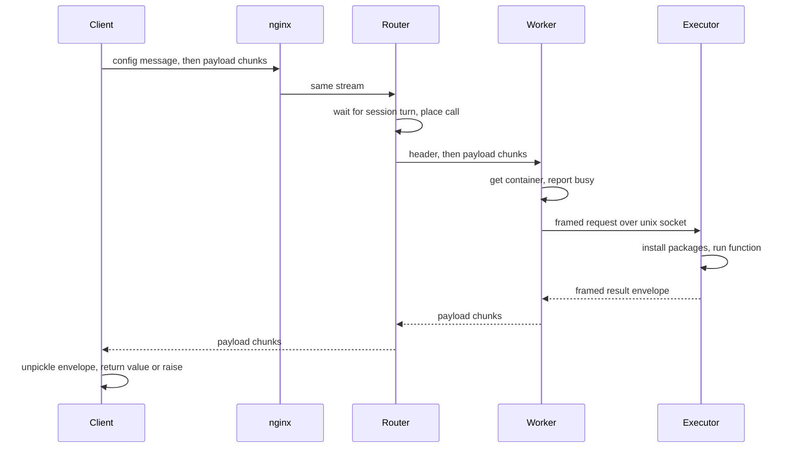

A call to a `@remote` function passes through five components. The client packs the function and its arguments and streams them to a router. The router selects a worker. The worker obtains a sandbox, usually by restoring a checkpoint, and hands the payload to a small Python program inside it. The result returns along the same path, and the client unpacks it and returns it as if the function had run locally.

## Sequence

## 1. Client packs the call

When a decorated function is called, the `readie` client (`pkg/`) performs these actions:

- Creates a request ID (`req-` plus a random hex string). If the call uses a [session](/docs/concepts/sessions), the client also sends the session ID. Without a session, the ID is empty and the router does no session bookkeeping for the call.
- Serializes the function, arguments, keyword arguments, and the `packages=` list with cloudpickle. For this reason the function must be picklable, and the client Python version must match the sandbox version (3.12).
- Reads the source of the function to list the top-level modules that it uses. These modules are hints for [checkpoint selection](/docs/concepts/checkpoints).
- Opens one bidirectional gRPC stream, `ProxyService.RequestExecution`, over TLS by default. If `READIE_AUTH_TOKEN` is set, the client sends it as a bearer token.

The first message on the stream carries only the **config**: import hints, memory and GPU-memory budgets, whether the call needs a GPU, and whether to skip checkpoints. Every later message carries a **payload chunk** of up to 1 MiB. A message never carries both config and payload.

Blocking calls use a blocking channel, and `.aio()` calls use an async channel. The protocol is identical.

## 2. nginx forwards the stream

nginx passes the HTTP/2 stream to `router:50051`. It adds no logic. Its read and send timeouts are one hour.

## 3. Router places the call

`ProxyService` in the router (`grpcserver/proxy_service.py`) performs these steps:

1. Reads the first message. The message must be a config message with a request ID, or the call fails with `INVALID_ARGUMENT`.
2. If the call has a session ID, waits for the turn of that session. Only one call per session runs at a time.
3. Converts the config into a demand. A missing memory budget becomes the router default (1 GiB). A call is a GPU call if the config says so or if any GPU memory budget is set.
4. Runs [placement](/docs/architecture/placement), which returns a worker, optionally a container to reuse, and a checkpoint ID.
5. Opens a stream to the chosen worker with a deadline of `EXECUTION_TIMEOUT` (one hour by default).

## 4. Router relays both directions

Two tasks run concurrently. The first copies the payload chunks of the client to the worker. Its first message to the worker is a header that carries the request, session, worker, container, and checkpoint IDs, the budgets, and the import hints, with an empty payload. Each client chunk follows. The second task copies the answers of the worker back to the client.

On the first answer, the router learns which container ran the call and records it for the session. If the client disconnects, the router cancels the worker call. When the call ends, the router always releases its reservation.

## 5. Worker acquires a container

`ExecutionService` in the worker (`worker/internal/grpcserver`, `execution`) performs these steps:

1. Reads the first message and builds the request.
2. Acquires a container. If the router named a container, the worker resumes it by re-applying its memory limit. Otherwise, the worker creates a new sandbox and starts it from the named checkpoint. If the checkpoint is empty, is missing, or fails to restore, the worker cold-starts the sandbox and records that no checkpoint was used. See [Container lifecycle](/docs/architecture/container-lifecycle).
3. Reports the container as busy to the router.
4. Connects to the unix socket of the executor. While the sandbox starts, the worker retries for up to 60 seconds (`DIAL_TOTAL_TIMEOUT`).

## 6. Executor runs the function

The worker streams the request to the executor in length-prefixed frames, without waiting for the whole payload to arrive. See [Executor protocol](/docs/architecture/executor-protocol). The executor performs these steps:

1. Unpickles the call.
2. Ensures that DNS works inside the sandbox.
3. Installs any `packages=` with `uv pip install`.
4. Runs the function with stdout and stderr captured.
5. Sends back a **result envelope**: `ok` and the value, or the exception type, message, and traceback.

An exception inside the function is data in the envelope and not a failure of the worker. The container stays healthy and reusable.

## 7. Result returns

The worker streams the envelope back in chunks. Each message repeats the request, session, worker, container, and checkpoint IDs and is marked successful. The router forwards the messages. The client collects the chunks and unpickles the envelope. It then either returns the value or raises `RemoteExecutionError` with the remote traceback.

Errors from the router (no capacity, session busy, session expired, deadline) arrive as gRPC status codes and become the matching client exception. See [Errors](/docs/reference/errors).

## Output and logs

The executor captures the stdout and stderr of the function and returns them inside the result envelope. After the call finishes, the client prints them to stderr, unless `stream_logs` is off. They are not shown line by line while the function runs. The wire format defines a separate `logs` message type for that purpose, but the worker does not currently send one.

## 8. Cleanup

After the response, the worker releases the container in the background. If the call had a session and succeeded, the container stays running and is marked ready for the next call. Otherwise, the worker destroys the container. In both cases, the router closes its lease on the call.

## Failure modes

| Where | Symptom |
| --- | --- |
| Router has no ready worker | `UNAVAILABLE`, the client raises `ClusterUnavailableError` |
| Every worker is full, or the session is busy | `RESOURCE_EXHAUSTED` |
| Session's container was destroyed | `NOT_FOUND`, the client raises `SessionExpiredError` |
| Deadline passes | `DEADLINE_EXCEEDED`, the client raises `RemoteTimeoutError` |
| The worker cannot finish (executor never answers, connection lost, container cannot be created) | The worker's status code is passed through: `DEADLINE_EXCEEDED`, `UNAVAILABLE` or `RESOURCE_EXHAUSTED` |

## What's next

- [Placement](/docs/architecture/placement): how the router selects the worker, container, and checkpoint.
- [Container lifecycle](/docs/architecture/container-lifecycle): the states of a container inside the worker.
- [Troubleshoot the stack](/docs/contributing/troubleshoot-the-stack): diagnose failures along this path.
