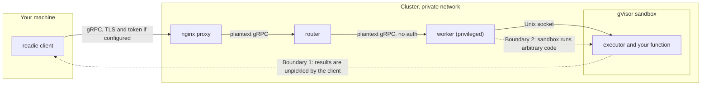

Readie runs code that users submit on shared machines and returns Python objects to the caller. Two trust relationships follow. The calling program must trust the cluster, because it unpickles the results that the cluster sends. The cluster contains submitted code in a gVisor sandbox, and that containment holds only as far as gVisor and the network configuration hold. By default, no connection is encrypted or authenticated, so configure both before exposing the router.

For the reporting process and the short form of the policy, see [Security](/docs/architecture/security). This page describes the model and the behavior of the code.

## Trust boundaries

Readie has two trust boundaries, shown as dotted lines in the diagram.

### Boundary 1: the client trusts the cluster

The client calls `cloudpickle.loads` on the bytes of every result. Unpickling can run arbitrary code by design. A compromised router or worker can therefore run code in the client process, with access to the files and credentials of that process. Validating the bytes cannot prevent this, because returning live Python objects is the feature.

The risk is confined to one place. The result decoder is a `ResultCodec` protocol in the SDK, so a deployment that cannot accept this risk can supply a codec that allows only a safe format. The cost is that the client no longer returns arbitrary objects. Point a client only at a router that you trust as much as the machine the client runs on.

### Boundary 2: the sandbox runs untrusted code

Running arbitrary code is the purpose of the product. Containment comes from [gVisor](/docs/guides/glossary), whose runtime `runsc` handles the program's system calls in user space instead of passing them to the host kernel. A sandbox built this way exposes a much smaller surface than an ordinary container.

The worker adds the following controls, verified in the code:

- **Shared filesystem, private writes.** All sandboxes use one root filesystem on disk. Writes go to an in-memory overlay (`root:memory`) that is private to the sandbox. The worker refuses to start with an overlay of `all:`, which would hide the executor's socket, or `:self`, which would write into the shared filesystem.
- **Limits.** Memory comes from the request (default 1 GiB). CPU is capped at half a core and processes at 100, both fixed values in the worker. `NoNewPrivileges` is set. The program runs as root inside the sandbox, which is not root on the host.
- **One call at a time.** The executor accepts one connection and runs one function at a time, so two calls never share an interpreter. The worker keeps a container idle for reuse only when the call belongs to a session.
- **Time limit.** `EXECUTION_TIMEOUT` sets the limit, one hour by default.

gVisor has the following limits:

- It does not make a bug in gVisor impossible. A sandbox escape is the residual risk.
- It does not restrict what submitted code can reach over the network. See [Network posture](#network-posture).
- It does not protect the worker. In the provided compose file, the worker runs `privileged` with AppArmor and seccomp turned off, because gVisor needs to create namespaces. Treat the worker host as sensitive.

The gVisor version is pinned in `pipeline/Dockerfile` and is used both to capture checkpoints and to run them. Updating it requires recapturing checkpoints, because the save format changes between releases.

## Network posture

`SANDBOX_NETWORK` is passed to `runsc --network`. The worker accepts `none`, `sandbox`, and `host`. The default is `sandbox`, which gives the sandbox routed access to the internet so that `@remote(packages=...)` can install from PyPI. This default has three consequences:

- Anything installed at request time carries the usual supply-chain risk, such as a mistyped package name.
- With `sandbox`, the worker builds a private network namespace for each container and sets up address translation (NAT). It blocks forwarding to the worker's own network subnet and to link-local addresses (`169.254.0.0/16`, where cloud metadata services live). Code in the sandbox therefore cannot reach the router or sibling containers through the network.
- The `host` setting shares the worker's own network, and you should avoid it. The `none` setting removes all network access, and `@remote(packages=...)` then fails when it tries to install.

The executor's docstrings describe the sandbox as having "no network". That description applies to the `none` setting, not to the default.

## Authentication

By default, the router speaks plaintext gRPC and checks no credentials. To require authentication:

1. Set `AUTH_TOKEN` on the router. The router then requires an `authorization: Bearer <token>` header on every call to `ProxyService`, the only path that runs code.
2. Set the same token for clients with the `READIE_AUTH_TOKEN` environment variable.

A missing or wrong token receives `UNAUTHENTICATED`. The comparison is constant-time. Health checks, reflection, and `RegistryService` (the worker mesh) are exempt.

The check sits behind an `Authenticator` protocol, so a deployment can replace the single shared token with a stronger mechanism.

## TLS

The router listens on a plaintext port. The nginx proxy in front of it provides TLS. In the `run-prod` compose setup, nginx listens on port 443 with a certificate and key that you supply. In the `run-local` setup, nginx listens on port 50051 without TLS.

The client uses TLS by default. See [Deploy with TLS](/docs/contributing/deploy-with-tls).

## Unprotected paths

The router-to-worker connection and the worker's own server are plaintext and unauthenticated by design. Keep the router and workers on a private network, and do not publish the worker's port. The compose files publish only nginx.

Do not expose the router's port to anyone who should not have shell access, because a caller that reaches it without a token can execute code.

Container limits bound executions. Heavy resource use by a submitted function is an operational matter, not a vulnerability, and so is a function reading the filesystem of its own sandbox.

## See also

- [Security](/docs/architecture/security)
- [Deploy with TLS](/docs/contributing/deploy-with-tls)
- [Executor protocol](/docs/architecture/executor-protocol)
