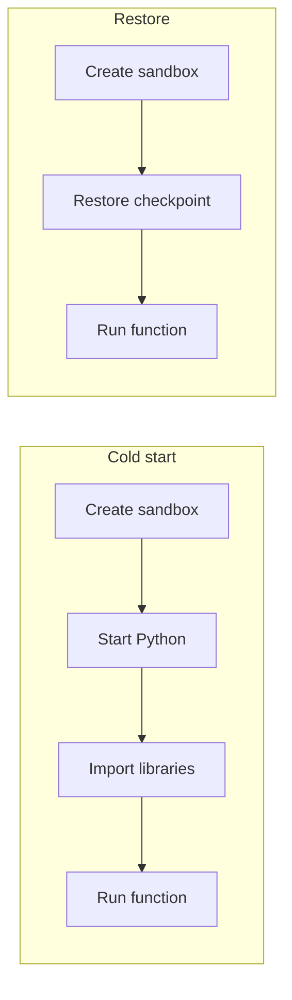

A **cold start** is the work a new environment performs before the first line of a function runs. Readie performs the expensive part of that work once, ahead of time, and saves the running process as a checkpoint. When a call arrives, the worker restores the checkpoint instead of starting Python and importing libraries again.

## Cold start

For Python, a cold start consists of three steps:

1. Create the sandbox.
2. Start the Python interpreter.
3. Import the libraries the function uses.

Step 3 is often the largest. The repository README gives two examples: `import pandas` alone takes about a quarter of a second, and `import torch` takes several seconds. These are approximate figures from the project's own notes and not a benchmark. Actual times depend on the machine.

Serverless platforms without checkpoints pay this cost on most new containers. The function body can finish in milliseconds while the imports take far longer.

## Restore

Readie moves the import cost out of the request path in three stages:

1. Offline, a build step starts the executor, the program that runs functions inside every sandbox, with a chosen set of libraries already imported. See [Building checkpoints](/docs/architecture/building-checkpoints).
2. gVisor, the sandbox technology Readie uses, saves the entire running process, including its memory and state. The saved image is a **checkpoint**. See [Checkpoints](/docs/concepts/checkpoints).
3. At call time, the worker restores a checkpoint into a new sandbox. The process continues from the moment it was saved, with the libraries already in memory.

In the restore path, a single restore step replaces "Start Python" and "Import libraries". A larger checkpoint holds more libraries but occupies more space and takes longer to restore. For this reason Readie does not place every library in one checkpoint.

## Checkpoint selection

Different functions need different libraries. The client scans the function for imports and sends them to the router as hints. The router selects the checkpoint that best fits the call, which is the one that already holds most of the needed libraries at an acceptable size. The selection weighs the size of the checkpoint against the import time it saves. See [Cost model](/docs/concepts/cost-model) and [Flavors and catalogues](/docs/concepts/flavors-and-catalogues).

If a selected checkpoint lacks a library that the function needs, the function still runs. The missing imports happen at call time.

## Fallback to a cold start

Readie performs a normal cold start in the following cases:

- No checkpoints are available on the worker, or the router has no catalogue loaded.
- Restoring a checkpoint fails. The worker logs a warning and starts cold.
- The function sets `disable_optimized_execution=True`.

Calls that reuse the existing sandbox of a session skip startup entirely. See [Sessions](/docs/concepts/sessions).

## Limitations

- Restoring checkpoints requires gVisor on an amd64 Linux host.
- Restore needs no change to user code. The client only scans the function for imports and sends them as hints, and the platform decides which checkpoint to use.

## What's next

- [Sandboxes](/docs/concepts/sandboxes)
- [Request lifecycle](/docs/architecture/request-lifecycle)
- [Checkpoints](/docs/concepts/checkpoints)
