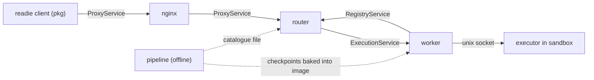

Readie has an online half that runs functions and an offline half that prepares checkpoints. In the online half, a Python client sends a call through a proxy to a router, the router selects a worker, and the worker runs the function in a sandbox. The offline half, the pipeline, prepares the checkpoints that workers restore. All components communicate over gRPC, a typed network protocol, except the last hop inside the sandbox.

## Architecture

Solid lines show the path of one call. Dotted lines show files produced ahead of time. The services come from the `.proto` files in `protos/`. They declare no package name, so on the wire they appear as bare names such as `/ProxyService/RequestExecution`.

## Client

The client lives in `pkg/` and is imported as `readie`. It is the only component that users install. A user decorates a function with `@remote`. When the function is called, the client pickles the function and its arguments with cloudpickle, a library that serializes Python functions. It splits the bytes into 1 MiB chunks and streams them to the router with the `ProxyService` call.

The client also sends hints: the modules the function uses, memory and GPU limits, and a session ID when one is used. It reassembles the reply, unpickles it, and returns the value or raises the remote error. See [SDK reference](/docs/guides/sdk).

## NGINX

NGINX is a thin reverse proxy in front of the router. It accepts gRPC over HTTP/2 and forwards it to `router:50051`. The local configuration (`nginx.local.conf`) listens on plain port 50051. The production configuration listens on port 443 with TLS and a certificate that the operator supplies. Read and send timeouts are one hour, which bounds the longest call. See [Deploy with TLS](/docs/contributing/deploy-with-tls).

## Router

The router lives in `router/` and is written in Python. It decides where each call runs. By default it serves two gRPC services on port 50051:

- `ProxyService`, which clients call. Each function call is one streaming call. Only this service can run code, so it is the only one that can require a bearer token (`AUTH_TOKEN`).
- `RegistryService`, which workers call to report their existence, capacity, load, and the state of each container.

The router keeps the list of workers, containers, and sessions in memory. It checks the health of every worker every few seconds and drops workers that stop answering. See [Placement](/docs/architecture/placement).

## Worker

The worker lives in `worker/` and is written in Go. A worker is one machine or one container that runs sandboxes. It serves `ExecutionService` on port 50052 in the provided image. The port comes from the required `PORT` setting.

For each call the worker obtains a container, either a new one restored from a checkpoint or an existing one for a session. It sends the pickled function to the executor, relays the answer, and reports status to the router through `RegistryService`. It drives `runsc` from gVisor to create, restore, and destroy sandboxes. See [Container lifecycle](/docs/architecture/container-lifecycle).

## Executor

The executor lives in `executor/` and runs on Python 3.12. It is a small Python program that runs inside every sandbox. After a restore, it opens a unix socket named `executor.sock` in `/tmp` of the sandbox, which is shared with the worker. The worker connects to the socket and sends the call.

The executor unpickles the call, installs any requested packages, runs the function, and captures its output. It then sends back a result envelope that contains either `ok` with the value, or the exception type, message, and traceback. It handles one call at a time. See [Executor protocol](/docs/architecture/executor-protocol).

## Pipeline

The pipeline lives in `pipeline/` and runs on Python 3.13. It runs offline, before anything is deployed. It studies a corpus of example code, measures the import time and memory use of each package, plans which packages go into which checkpoint, and captures the checkpoints in sandboxes.

The pipeline writes two outputs: the checkpoints, which are baked into the worker image, and the catalogue file that the router reads. Capture requires an amd64 gVisor host. See [Building checkpoints](/docs/architecture/building-checkpoints).

## Communication paths

| From | To | Over | Purpose |
| --- | --- | --- | --- |
| client | nginx, then router | gRPC `ProxyService` | Submit a call and stream results back. |
| router | worker | gRPC `ExecutionService` | Run one call on the chosen worker. |
| router | worker | gRPC health check | Probe liveness. |
| worker | router | gRPC `RegistryService` | Report status and load. |
| worker | executor | Unix socket, length-prefixed frames | Send the call and read the result. |

The router and the worker also share the `resources.proto` messages that describe memory and GPU budgets.

## What's next

- [Request lifecycle](/docs/architecture/request-lifecycle)
- [Placement](/docs/architecture/placement)
- [Cold starts and restore](/docs/concepts/cold-starts-and-restore)
