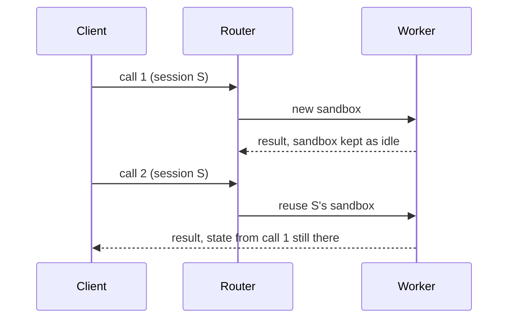

A session is a client-supplied identifier that tells Readie to reuse the same sandbox for a series of calls. Variables, loaded models, and imports persist from one call to the next. A sandbox holds one Python interpreter, so calls in a session run one at a time. The session ends when its sandbox is removed, which happens after the sandbox has been idle for a configured time.

For usage in code, see [Sessions and errors](/docs/getting-started/sessions-and-errors).

## Calls without a session

A call without a session sends an empty session ID. The router skips all session bookkeeping for the call, and the worker destroys the sandbox after the call finishes. This is the default. A fresh sandbox has no leftover state, and nothing accumulates.

## Calls in a session

When a call passes a session, the session ID travels with every call. The router remembers which worker and sandbox served the session last. This link is called **affinity**.

A session call proceeds as follows:

1. **First call.** The router has not seen the ID, or has no sandbox for it. It selects a worker like any new call, using a snapshot where possible (see [Placement](/docs/architecture/placement)). When the worker confirms the sandbox, the router binds the session to it.
2. **Later calls.** Affinity takes precedence over load balancing. The router sends the call to the same sandbox even if another worker is less busy, because moving would lose the state of the session.
3. **After each successful call.** The worker leaves the sandbox running and marks it idle.

A user exception in the function still counts as a normal finished call, so the sandbox stays. If a call fails in a way that kills the executor or the run itself, the worker destroys the sandbox and the session is retired.

## Serialization of calls

A sandbox has one Python process that listens on one socket. It cannot run two functions at once, and two functions would share the same global variables.

The router therefore holds a queue for each session. A second call on a session waits for the first to finish and then runs. If the wait exceeds the session wait timeout of the router (60 seconds by default, `SESSION_WAIT_TIMEOUT` on the router), the call fails and the client raises `ResourceExhaustedError`. Different sessions never wait on each other.

## Session expiry

The router keeps no timer for a session, and `Session.close()` sends nothing. Only the lifetime of the sandbox matters. A session ends in the following cases:

- **Worker idle timeout.** The worker destroys the sandbox of a session after it has been idle for `SANDBOX_IDLE_TTL`. The default is 5 minutes, and 0 disables the timeout. A background check runs every 30 seconds, so removal can lag by up to about 30 seconds. The clock restarts each time the sandbox becomes idle after a call.
- **Other removal.** The router evicts the worker because it stopped answering health checks, the sandbox is reported as failed or removed, or the router has not heard about the sandbox for 10 minutes (`EXECUTOR_TTL`, default 600 s) and the sandbox is not busy.

The sandbox is not paused or frozen while idle. It stays running and keeps using its memory the whole time.

When the router learns that the sandbox is gone, it marks the session **expired** and keeps that record. A later call with that ID raises `SessionExpiredError` instead of silently starting fresh, because a silent restart would hide the loss of state. To continue, open a new `Session`.

Two cases are not errors:

- An ID that the router has never seen. The call starts a new sandbox.
- A session whose sandbox is broken (status error) but not yet gone. The router drops the pin, and the next call starts a new sandbox.

## Limitations

- A memory-related retry (see [Packages and resources](/docs/getting-started/packages-and-resources)) is never applied to session calls, because a new sandbox would lose the state.
- Setting `disable_optimized_execution=True` on a call whose session sandbox came from a snapshot is refused with `InvalidRequestError`.
- A session cannot move between workers.

## What's next

- [Sessions and errors](/docs/getting-started/sessions-and-errors)
- [Sandboxes](/docs/concepts/sandboxes)
- [Placement](/docs/architecture/placement)
