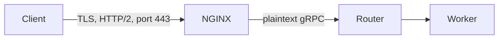

Use this procedure to expose the router on a public host with encrypted traffic and token authentication. By default, the router accepts plaintext gRPC with no authentication, which is appropriate for a local machine only.

A public deployment needs two protections. TLS encrypts traffic and lets clients verify that they reached the intended server. A bearer token restricts code execution on the cluster to callers that hold the token. NGINX terminates TLS, and the router checks the token. The procedure applies to any Linux host with Docker. The example configuration in the repository uses an Azure VM hostname, but no step is specific to Azure.

## Architecture



- The client connects over TLS to NGINX on port `443`.
- NGINX forwards the gRPC stream to `router:50051` inside the Compose network.
- The router and the worker are never published on the host.

The router has no TLS settings. TLS is configured only in NGINX.

:::warning Keep the router private
Workers register with the router over plaintext, with no token. The token guards only the client-facing service. Do not expose ports `50051` or `50052` to the internet.
:::

## Prerequisites

- A host that can run the full stack. The worker requires an amd64 Linux host. See [Run the stack locally](/docs/contributing/run-the-stack).
- A public DNS name that points at the host.
- A TLS certificate and private key for that name. The steps use Let's Encrypt through Certbot, but any certificate authority works.
- Inbound TCP port `443` open in the firewall or cloud security group.

## Step 1: Configure DNS and the firewall

1. Create a DNS `A` record that maps the hostname (for example `readie.example.com`) to the public IP address of the host.
2. Open inbound TCP port `443`. Keep `50051` and `50052` closed. The production compose file publishes only `443`, and a firewall rule adds a second layer of protection.

## Step 2: Obtain a certificate

On the host, run Certbot:

```bash
sudo certbot certonly --standalone -d readie.example.com
```

The `--standalone` mode starts a temporary web server on port 80 to prove ownership of the name, so port 80 must be free and reachable during issuance. Certbot writes the files to `/etc/letsencrypt/live/readie.example.com/`.

NGINX expects exactly two files, mounted from `nginx/certs/` in the repository into `/etc/nginx/certs/`:

| File | Content |
| --- | --- |
| `nginx/certs/server.crt` | The certificate chain (Certbot's `fullchain.pem`). |
| `nginx/certs/server.key` | The private key (Certbot's `privkey.pem`). |

Copy the files instead of linking them, because Certbot's `live` files are symlinks that do not resolve inside a container mount:

```bash
sudo cp /etc/letsencrypt/live/readie.example.com/fullchain.pem nginx/certs/server.crt
sudo cp /etc/letsencrypt/live/readie.example.com/privkey.pem   nginx/certs/server.key
sudo chmod 600 nginx/certs/server.key
```

The repository includes the certificate chain `nginx/certs/server.crt` for the example hostname, with no private key. Replace it with the certificate for your own hostname, and do not commit the private key.

## Step 3: Set the hostname in the NGINX configuration

In `nginx/nginx.prod.conf`, change `server_name` to the hostname. The file currently holds the example name `readie.eastus.cloudapp.azure.com`.

```nginx
server {
    listen 443 ssl;
    http2 on;

    server_name readie.example.com;

    ssl_certificate     /etc/nginx/certs/server.crt;
    ssl_certificate_key /etc/nginx/certs/server.key;

    location / {
        grpc_pass grpc://grpc_router;

        grpc_read_timeout 1h;
        grpc_send_timeout 1h;
    }
}
```

Two settings are specific to gRPC:

- `http2 on;` enables HTTP/2, which gRPC requires.
- `grpc_read_timeout` and `grpc_send_timeout` are `1h`, which lets a long-running call stay open. The router's execution timeout (`EXECUTION_TIMEOUT`) defaults to 3600 seconds, so the values match. If you raise `EXECUTION_TIMEOUT`, raise these two settings as well.

## Step 4: Enable the bearer token

1. Generate a long random token:

   ```bash
   python -c "import secrets; print(secrets.token_urlsafe(32))"
   ```

2. Create an override file named `docker-compose.auth.yml` next to the other compose files. The router reads the token from its `AUTH_TOKEN` environment variable, and the compose file does not set it.

   ```yaml
   services:
     router:
       environment:
         AUTH_TOKEN: ${READIE_ROUTER_AUTH_TOKEN:?set READIE_ROUTER_AUTH_TOKEN}
   ```

   The `:?` syntax makes Compose stop with an error if the variable is missing. Without it, an empty value would leave the router without authentication, because an empty `AUTH_TOKEN` means authentication is off.

3. Set the value in `.env` as `READIE_ROUTER_AUTH_TOKEN=<token>`, which Compose reads for substitution, or export it in the shell. Do not commit the token.

When the token is set, the router requires `authorization: Bearer <token>` on every client call to the `ProxyService`. The router compares the token in constant time. A call without a valid token fails with the gRPC status `UNAUTHENTICATED` and the message `a valid bearer token is required`. Worker registration, health checks, and reflection are exempt, so the Compose health check works without a token.

## Step 5: Start the stack

Start the production files together with the override:

```bash
docker compose \
  -f docker-compose.yml \
  -f docker-compose.prod.yml \
  -f docker-compose.auth.yml \
  up -d --build
```

The `make run-prod` target runs only the first two files, so use this command when the override is present.

Check the NGINX configuration and the containers:

```bash
docker compose exec nginx nginx -t
docker compose ps
```

After a certificate renewal, copy the new files into `nginx/certs/` as in step 2, then reload NGINX without downtime:

```bash
docker compose exec nginx nginx -s reload
```

## Step 6: Distribute the token

If you set an authentication token in step 4, give it to the people who call the service. Each caller sets it in the `READIE_AUTH_TOKEN` environment variable before starting a program. Send the token over a private channel and do not commit it.

## Verify

From a machine outside the host, confirm that port 443 accepts a TLS connection and that the certificate matches the hostname:

```bash
openssl s_client -connect <your-host>:443
```

`<your-host>` is the DNS name from step 1. The output includes the certificate chain and the subject of the certificate that NGINX serves.

## Troubleshoot

If callers report failures, see [Troubleshoot the stack](/docs/contributing/troubleshoot-the-stack).

## Hardening checklist

The defaults are open so that local runs and tests work without certificates. Before exposing a router, apply the following measures.

1. Turn on TLS. NGINX terminates TLS in front of the router, as described in the preceding steps. The client uses TLS by default.
2. Set a token. Set `AUTH_TOKEN` on the router and give the same value to clients as `READIE_AUTH_TOKEN`. The router then requires the token on the one service that runs code. Health checks, reflection, and worker registration do not need it.
3. Keep the router and worker network private. Calls from the router to the workers, and the worker's own server, use plaintext gRPC with no authentication. Run them on a private network. Never expose the worker's port. Do not expose the router's port to anyone who should not have shell access.
4. Choose the sandbox network mode. The worker's `SANDBOX_NETWORK` setting defaults to `sandbox` when unset. That value gives sandboxed code routed network access, so it can reach PyPI to install packages. Set `SANDBOX_NETWORK=none` for a network-isolated posture. Prefer `sandbox` over `host`, because `host` shares the worker's own network with the sandbox. The example env file in `worker/` sets `none`, so check which value the deployment uses.
5. Pin packages. If you allow `@remote(packages=...)`, unpinned or mistyped names carry supply-chain risk. That risk comes with any network access.
6. Isolate the host. Run workers on machines that hold nothing else of value. The compose file runs the worker container as privileged, and a sandbox escape lands on that host.
7. Keep secrets out of the repository. The pipeline reads `AZURE_API_KEY` and `AZURE_ENDPOINT` only to generate corpus data, from the environment or a git-ignored `.env` file. The pipeline does not write them to the corpus, manifests, or logs.

Egress from a sandbox excludes the worker's own container network and the link-local range `169.254.0.0/16`, where cloud metadata services live.

## What's next

- [Security model](/docs/architecture/security-model)
- [Configure the services](/docs/contributing/configure-services)
- [Troubleshoot the stack](/docs/contributing/troubleshoot-the-stack)
