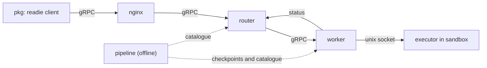

Readie is a single repository that contains several programs. Each folder has its own build, tests, and `README.md`. This page maps each folder to its role so that a change can be made in the right place.

## Folders

| Path | Language | Role |
| --- | --- | --- |
| `pkg/` | Python 3.12 | The `readie` SDK, which provides the `@remote` decorator. It is installed and imported as `readie`. |
| `nginx/` | NGINX config | The entry point. Accepts client connections and forwards them to the router. |
| `router/` | Python 3.13 | Decides which worker runs each call and keeps the list of live workers. |
| `worker/` | Go 1.25 | Starts and stops sandboxes, restores checkpoints, and communicates with the executor. |
| `executor/` | Python 3.12 | Runs inside every sandbox. Unpickles the function and calls it. |
| `pipeline/` | Python 3.13 | Offline tool that builds checkpoints. It is not part of serving a request. |
| `protos/` | Protocol Buffers | The gRPC message and service definitions shared by all components. |

The repository contains these additional folders and files:

- `catalogues/` holds one JSON file per [flavor](/docs/concepts/flavors-and-catalogues), for example `cpu.json`. The router reads these files to choose a checkpoint.
- `.github/` holds CI workflows, the pull request template, and the issue templates.
- `docs/` holds this documentation site.
- The root `Makefile` runs the same verb in every component. `docker-compose.yml` and its `local` and `prod` variants start the router and a worker.

## Component connections

A call proceeds from left to right:

1. The code calls a function decorated with `@remote`. The client pickles the call and sends it over [gRPC](/docs/concepts/glossary).
2. NGINX forwards the call to the router.
3. The router selects a worker and forwards the call.
4. The worker restores a [checkpoint](/docs/concepts/checkpoints) into a [sandbox](/docs/concepts/sandboxes), or reuses a warm sandbox.
5. The worker sends the call to the executor over a unix socket. The executor runs the function and returns the result along the same path.

Dotted lines show offline work. The pipeline builds checkpoints and writes a catalogue. The checkpoints are baked into the base image of the worker, and the catalogue is mounted on the router. For details, see the [architecture overview](/docs/architecture/overview) and the [request lifecycle](/docs/architecture/request-lifecycle).

## Shared contracts

Components agree on two contracts. A change to either requires coordinated edits.

- **Protos.** `protos/` contains four files: `proxy.proto` (client to router), `execution.proto` (router to worker), `registry.proto` (workers reporting to the router), and `resources.proto` (shared resource budgets). Generated code is committed. See [Changing protos](/docs/contributing/changing-protos).
- **Executor wire format.** The worker and the executor frame bytes the same way over their socket. The format is implemented in two languages. See [Changing the executor protocol](/docs/contributing/changing-executor-protocol).

## Test locations

| Component | Test folder | Notes |
| --- | --- | --- |
| `pkg/` | `pkg/tests/unit`, `pkg/tests/integration` | Integration tests run a real client against a fake router. |
| `router/` | `router/tests/unit`, `router/tests/integration` | Integration tests use a real in-process gRPC channel. |
| `executor/` | `executor/tests/unit`, `executor/tests/integration` | Includes the shared framing fixture in `executor/tests/data`. |
| `pipeline/` | `pipeline/tests/unit`, `pipeline/tests/integration` | Planning and manifest tests run without Docker. |
| `worker/` | `_test.go` files next to the code | `worker/internal/integration` holds the larger scenarios. Fakes live in `worker/internal/testutil`. |

The worker has four test tiers. Three run on any machine. The fourth, `make -C worker test-e2e`, requires a real amd64 gVisor host. The Testing section of the worker `README.md` describes the tiers.

## Source layout

Python components keep code under `src/<package>/` and tests under `tests/`:

- `pkg/src/readie/` contains the SDK. `_proto/` holds generated code.
- `router/src/readie_router/` contains `scheduling/` (placement), `workers/` (communication with workers), `grpcserver/` (the gRPC services), and `proto/` (generated code).
- `executor/src/readie_executor/` contains `protocol.py` (framing) and `server.py`.
- `pipeline/src/readie_pipeline/` contains `corpus/`, `metadata/`, `planning/`, and `capture/`.

In Go, `worker/cmd/` holds two programs (`worker` and `ocispec`) and `worker/internal/` holds the packages. `worker/proto/` is generated.

## What's next

- [Set up your environment](/docs/contributing/setup)
- [Conventions](/docs/contributing/conventions)
