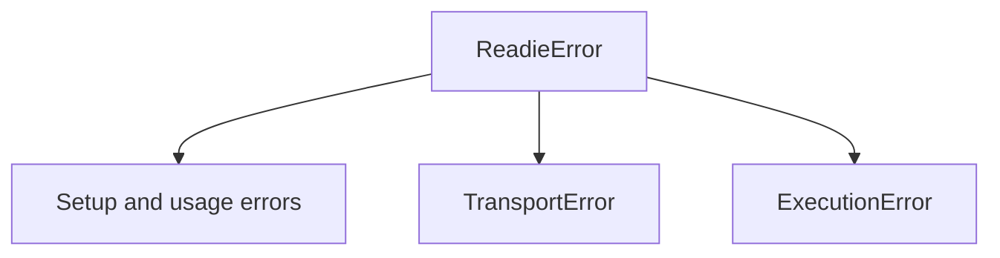

All exceptions raised by the client inherit from `readie.ReadieError`. They fall into three groups: setup and usage errors, transport errors (`TransportError`), and execution errors (`ExecutionError`).

## Setup and usage

These errors indicate invalid configuration or incorrect use of the client.

| Exception | Condition | Action |
| --- | --- | --- |
| `IncompatiblePythonError` | A `Client` is created on a Python version other than 3.12. | Use Python 3.12. |
| `ConfigurationError` | `Settings` or a budget is invalid: a non-positive `timeout` or `chunk_size`, an unparseable or negative size, or `max_memory` below `memory`. Raised at construction or decoration. | Correct the value. |
| `InvalidPackageError` | A `packages=` entry is not a valid requirement. Subclass of `ConfigurationError`. | Correct the spelling or version specifier. |
| `SerializationError` | The call cannot be pickled, or the result cannot be unpickled. | Remove unpicklable objects from the function or its arguments, and confirm that Python and library versions match. |
| `ClientClosedError` | A closed `Client` or `Session` is used. | Create a new instance. |
| `BlockingCallInEventLoopError` | A blocking call is made while an event loop is running. | Use `await fn.aio(...)`. |

## Transport errors

A `TransportError` indicates that the call did not complete because of the router or the network. Each transport error has a `code` attribute that holds the gRPC status name.

| Exception | gRPC status | Condition | Action |
| --- | --- | --- | --- |
| `ClusterUnavailableError` | `UNAVAILABLE` | The service is unreachable or no worker is available. | Retry later. |
| `RemoteTimeoutError` | `DEADLINE_EXCEEDED` | The `timeout` passed. | Raise or remove `timeout`. |
| `InvalidRequestError` | `INVALID_ARGUMENT`, `FAILED_PRECONDITION`, `OUT_OF_RANGE` | The router rejected the request. One case is `disable_optimized_execution=True` on a session already restored from a snapshot. | Correct the request. |
| `ResourceExhaustedError` | `RESOURCE_EXHAUSTED` | No worker has room, a session's queue wait exceeded 60 s (router default), or a message was too large. | Retry later, or use more sessions. |
| `ExecutionCancelledError` | `CANCELLED` | The call was cancelled. | Retry if the cancellation was unintended. |
| `PermissionDeniedError` | `PERMISSION_DENIED`, `UNAUTHENTICATED` | The auth token is missing or wrong. | Set `READIE_AUTH_TOKEN`. |
| `SessionExpiredError` | `NOT_FOUND` | The session existed, but its sandbox is gone. | Open a new session. Session state is lost. |
| `TransportError` | Any other status | Any other failure, including `INTERNAL`. | Retry. If the error persists, contact the operator. |

## Execution errors

An `ExecutionError` indicates that the call ran but produced no usable result. These errors carry `logs` (a tuple of output lines), `worker_id`, and `container_id`. The message includes the last 40 log lines.

| Exception | Condition | Action |
| --- | --- | --- |
| `RemoteExecutionError` | The function raised, a `packages=` install failed, or the worker marked the run as failed. Has the attributes `remote_type`, `remote_message`, and `remote_traceback`. | Read the traceback. |
| `EmptyResultError` | The worker sent no result, or sent something that is not a result envelope, for example from an executor that speaks an older protocol. A function that returns `None` does not raise this error. | Check `logs` and consider a larger `memory` value. If the error repeats, report it to the operator. |

## See also

- [Sessions and errors](/docs/getting-started/sessions-and-errors)
- [Troubleshooting](/docs/guides/troubleshooting)
- [SDK reference](/docs/reference/sdk)
